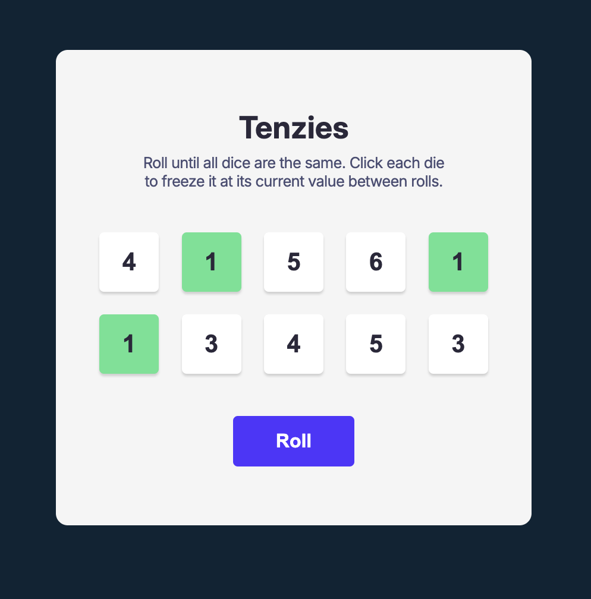

# Tenzies

A React implementation of the [Tenzi dice game](https://ilovetenzi.com/rules/) built for the Scrimba front-end developer path. Used as a learning exercise to practice useState & useEffect.

## Features

- Handles user interaction for holding & un-holding dice, shows animated confetti on win

## Technologies Used

- HTML
- CSS
- JavaScript
- React
- Vite

## Resources

- [Figma design](https://www.figma.com/design/FqsxRUhAaXM4ezddQK0CdR/Tenzies)

## Installation

- `npm install`
- `npm run dev` for local server or `npm run build`